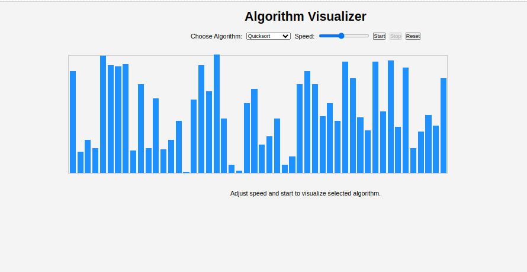
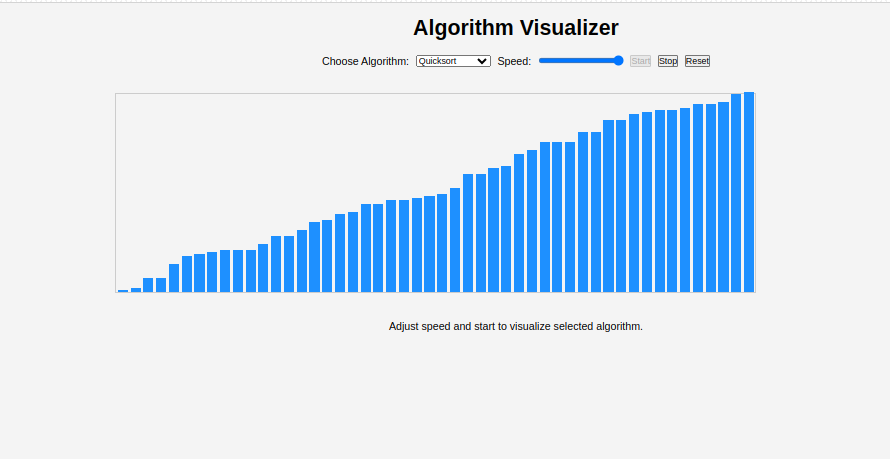

# Algorithm Visualizer

A simple web-based application to visualize popular sorting algorithms. This project helps users understand how algorithms like Quick Sort, 
Bubble Sort, Merge Sort, Insertion Sort, and Selection Sort work through visual animations. 

## Features

- **Choose Algorithm**: Select from Quicksort, Bubble Sort, Merge Sort, Insertion Sort, and Selection Sort.
- **Control Speed**: Adjust the speed of the visualization.
- **Start, Stop, and Reset Controls**: Start the visualization, pause it, or reset the array to random values.
- **Responsive Interface**: A user-friendly control panel and visual display of array sorting in real time.

## Screenshots

### Main Screen


### Algorithm Visualization


## Installation and Usage

1. **Clone the Repository**:
   ```bash
   git clone https://github.com/khlongwa-code/sorting-algorithms-visualizer.git

2. **Navigate to the Project Directory**:
   ```bash
   cd sorting-algorithms-visualizer

3. **Open the Application**:

   Open ```display.html``` in your browser to start the algorithm visualizer.

## File Structure

- **display.html**: The main HTML file containing the layout of the app.
- **static/css/style.css**: The CSS file for styling the application.
- **scripts/algorithms.js**: JavaScript file containing sorting algorithms and visual rendering logic.

## How It Works

1. **Algorithm Selection**: Users can select an algorithm from a dropdown menu. Available algorithms include:
   - Quick Sort
   - Bubble Sort
   - MergeSort
   - Insertion Sort
   - Selection Sort

2. **Speed Control**: Adjust the speed slider to change the animation speed in real-time.

3. **Buttons**:
   - **Start**: Begins the sorting process for the selected algorithm.
   - **Stop**: Pauses the sorting animation.
   - **Reset**: Generates a new random array to visualize.

## Code Explanation

- **initializeArray()**: Generates a random array of integers to visualize.

- **renderArray()**: Displays the array as a series of vertical bars with height proportional to the value.

- **Sorting Functions**: Each sorting algorithm (Quicksort, Bubble Sort, Merge Sort, Insertion Sort, Selection Sort) is 
  implemented as an asynchronous function to allow for step-by-step visualization.

- **Swap and Sleep Functions**: Helper functions for swapping array elements and adding delay to control the speed.

## Technologies Used

- **HTML**: Structure of the application.
- **CSS**: Styling of the control panel and array visualization.
- **JavaScript**: Sorting algorithms and animation control logic.

## Future Improvements

- Add more sorting algorithms (e.g., Heap Sort, Radix Sort).
- Improve animations with color-coding for comparison and swapping steps.
- Add explanations for each step of the algorithm.
